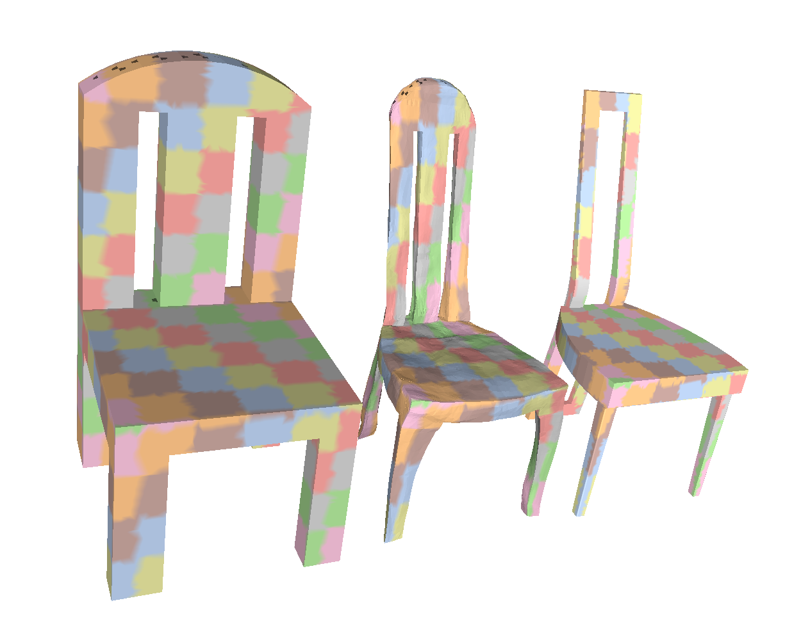

# **CycleConsistentDeformation** [[Project Page]](http://imagine.enpc.fr/~groueixt/sgp/index.html) [[Paper]](https://arxiv.org/abs/1907.03165) [[Talk]](http://imagine.enpc.fr/~groueixt/sgp/sgp/sgp.pptx)

 **Unsupervised cycle-consistent deformation for shape matching** <br>
Thibault Groueix,  Matthew Fisher, Vladimir G. Kim , Bryan C. Russell, Mathieu Aubry  <br>
In [SGP, 2019](https://sgp2019.di.unimi.it/).




# Install

This implementation uses [Pytorch](http://pytorch.org/) and CUDA-10.0. 

```shell
git clone https://github.com/ThibaultGROUEIX/CycleConsistentDeformation.git
cd CycleConsistentDeformation; git submodule update --init
conda env create -f environment.yml; conda activate sensei
conda install pytorch torchvision cudatoolkit=10.0 -c pytorch
pip install http://imagine.enpc.fr/~langloip/data/pymesh2-0.2.1-cp37-cp37m-linux_x86_64.whl
```

# Demo

### 1. Target shape + Source Shape

Deform a source in a target and propagate a high-frequency texture from the source to the target, through the reconstruction. -> Require 2GB Gpu memory and 10sec to run (Tesla V100-SXM2-16GB).

```shell
chmod +x ./log/download_trained_models.sh # download the trained models
./log/download_pretrained_models.sh # download the trained models
export SHAPENET_PATH=./data/demo/
python inference/forward_source_target.py --cat Chair --shapenetv1_path ${SHAPENET_PATH} --logdir Chair_unsup --eval_source ${SHAPENET_PATH}03001627/7f9733a6370440dcc8687ff9b0b4e4ac/model.obj --eval_target ${SHAPENET_PATH}03001627/257deb231ce652169f2349486c570dd4/model.obj
```


### 2. Target shape + Source Dataset

Find the best source candidates for a given target and call `forward_source_target()` for each. ->Require 3GB Gpu memory and 90sec to run (Tesla V100-SXM2-16GB). First get a download link for shapenetcorev1 by creating an account here ->  [ShapenetCoreV1](https://www.shapenet.org/account/) 

```shell
# download Shapenetv1
wget {YOUR_DOWNLOAD_LINK} 
unzip ShapeNetCore.v1.zip; cd ShapeNetCore.v1
unzip 02691156.zip; unzip 03001627.zip; unzip 03636649.zip; unzip 04379243.zip;
export SHAPENET_PATH={YOUR_SHAPENET_PATH}

python inference/get_criterion_shape.py --cat Chair --shapenetv1_path ${SHAPENET_PATH} --logdir Chair_unsup --eval_get_criterions_for_shape ./data/dataset_shapenet/03001627/257deb231ce652169f2349486c570dd4.txt 
```

# Training

```
python ./training/train_shapenet.py
python ./inference/eval_segmentation.py
```

Check out the options in `auxiliary/argument_parser.py`

[Reproduce the paper](./paper.md)


## Citing this work

```
@INPROCEEDINGS{groueix19cycleconsistentdeformation,
  title     = {Unsupervised cycle-consistent deformation for shape matching},
  author    = {Groueix, Thibault and Fisher, Matthew and Kim, Vova and Russell, Bryan and Aubry, Mathieu},
  booktitle = {Symposium on Geometry Processing (SGP)},
  year      = {2019}
}
```


## License

[MIT](https://github.com/ThibaultGROUEIX/AtlasNet/blob/master/license_MIT)  : This work was funded by [Adobe System](https://github.com/fxia22/pointGAN) and [Ecole Doctorale MSTIC](http://www.univ-paris-est.fr/fr/-ecole-doctorale-mathematiques-et-stic-mstic-ed-532/).
